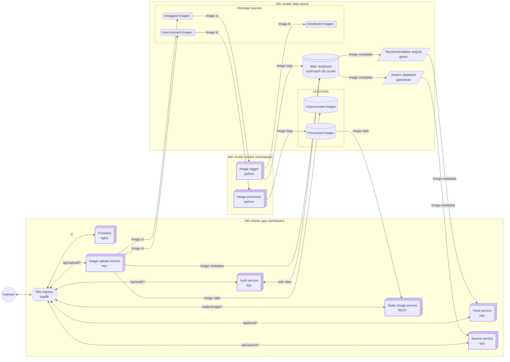

```mermaid
flowchart LR
  internet((Internet)) <--> ingress{{K8s-ingress}}

  subgraph k8s cluster app namespace
    ingress{{"K8s-ingress
    traefik"}}

    frontend@{shape: processes, label: "Frontend
    nginx"}

    auth@{shape: processes, label: "Auth service
    trpc"}

    upload@{shape: processes, label: "Image upload service
    trpc"}

    feed@{shape: processes, label: "Feed service
    trpc"}

    search@{shape: processes, label: "Search service
    trpc"}

    static@{shape: processes, label: "Static image service
    REST"}
  end

  subgraph k8s cluster worker namespace
    image-processor@{shape: processes, label: "Image processor
    python"}

    image-tagger@{shape: processes, label: "Image tagger
    python"}
  end

  subgraph k8s cluster data space
    subgraph s3 buckets
      un-images@{ shape: cyl, label: "Unprocessed images" }
      images@{ shape: cyl, label: "Processed images" }
    end

    subgraph message queues
      mq-process-images@{ shape: das, label: "Unprocessed images" }
      mq-tag-images@{ shape: das, label: "Untagged images" }
      mq-index@{ shape: das, label: "Unindexed images" }
    end

    database@{ shape: lin-cyl, label: "Main database
    cockroach db cluster" }

    search-db[/"Search database
    typesense"/]

    recommendation-engine[/"Recommendation engine
    gorse"/]
  end


  ingress <-- /* --> frontend
  ingress <-- /api/auth/* --> auth
  ingress <-- /api/upload/* --> upload
  ingress <-- /api/feed/* --> feed
  ingress <-- /api/search/* --> search
  ingress <-- /static/image/* --> static

  auth <-- user data --> database

  upload -- image id --> mq-process-images
  upload -- image data --> un-images
  upload -- image metadata --> database
  mq-process-images -- image id --> image-processor
  image-processor -- image data --> images
  upload -- image id --> mq-tag-images
  mq-tag-images -- image id --> image-tagger
  image-tagger -- image tags --> database
  image-tagger -- image id --> mq-index
  
  
  database -- image metadata --> search-db
  search-db -- image-metadata --> search

  database -- image metadata --> recommendation-engine
  recommendation-engine -- image-metadata --> feed

  images -- image data --> static

```
